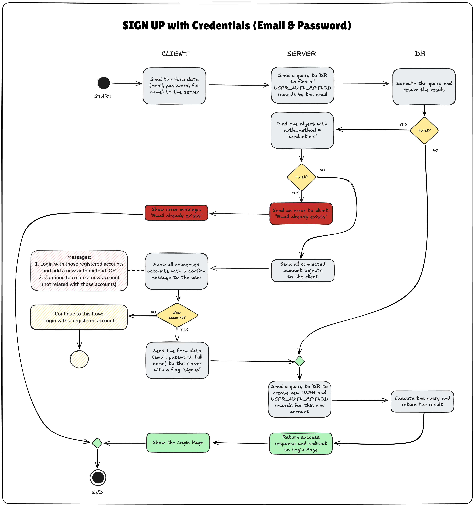

# Process Flows

## A. Sign Up with Credentials (Email & Password)

### A.1 Normal Flow
1. User submits the Sign Up Form.
2. Server sends a query to DB to find all `USER_AUTH_METHOD` records with `auth_identifier = "<email>"`.
3. DB executes the query and returns the result to the server.
   - If there is **one or more records**, continue to the **subflow S-1**.
4. Server sends a query to DB to create new a `USER` record with the submitted form data.
5. DB executes the query and returns the result to the server.
6. Server sends a query to DB to create a new `USER_AUTH_METHOD` record for this new user account with `auth_method = "credentials"` and `auth_identifier = <form.email>`.
7. DB executes the query and returns the result to the server.
8. Server sends a success response to the client and redirect it to the Login page.

#### A.1.1. Future Flow
In the last step, instead of redirect the user to the Login page, server can send a verification email to the user.

### A.2. Subflow
#### A.2.1. S-1: User account might exists
1. Server finds a record where `auth_method = "credentials"`.
   - If the record **does not exist**, continue to the **subflow S-2**.
2. Server returns an error response **"Email already exists"** to the client.
3. Client show an error message **"Email already exists"** on the Sign Up form.

#### A.2.2. S-2: Email is already used with other auth methods
1. Server returns a warning response, telling the user if we find that the email has been registered to the system using another authentication method (Google, Github, etc).
2. Client show sign in buttons of those authentication methods with a simple message and keep showing the sign up form (all fields are filled).
  - If the user decides to create a new account, continue to the **step #4 in Normal Flow**.
  - If the user decides to sign in using one of those authentication methods (e.g. Google), continue to the [Sign In with Google](/#d-sign-in-with-google) flow.

## B. Sign Up with Google
TODO

## C. Sign In with Credentials
TODO

## D. Sign In with Google
TODO